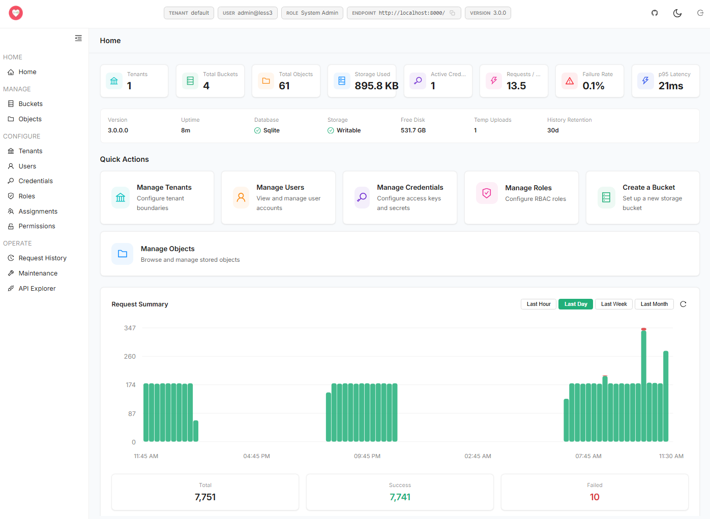
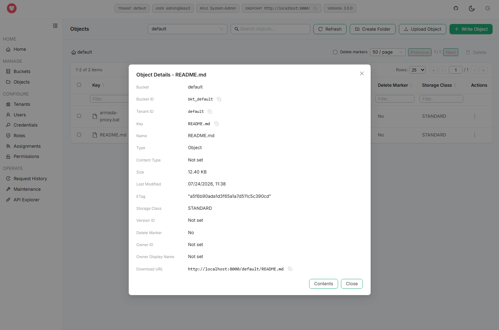
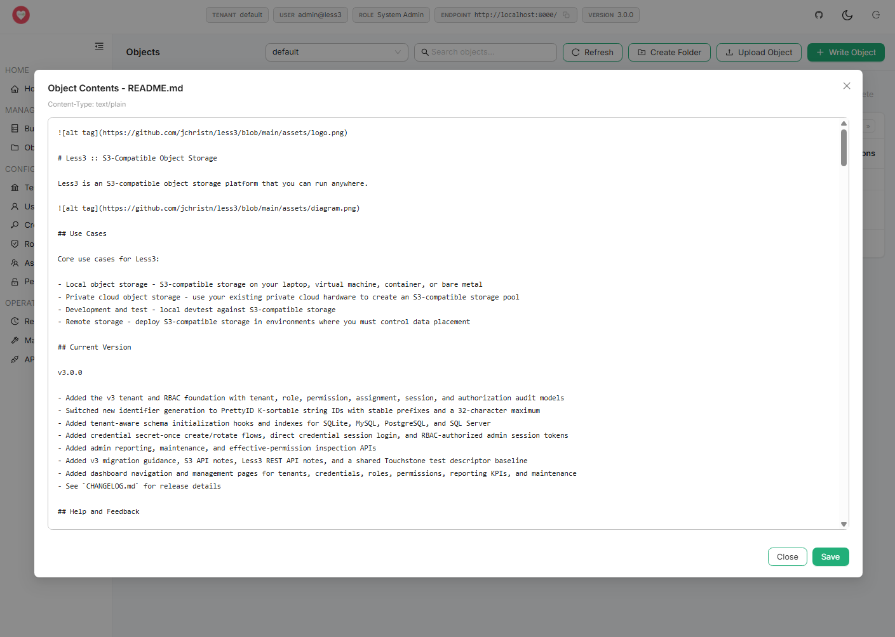
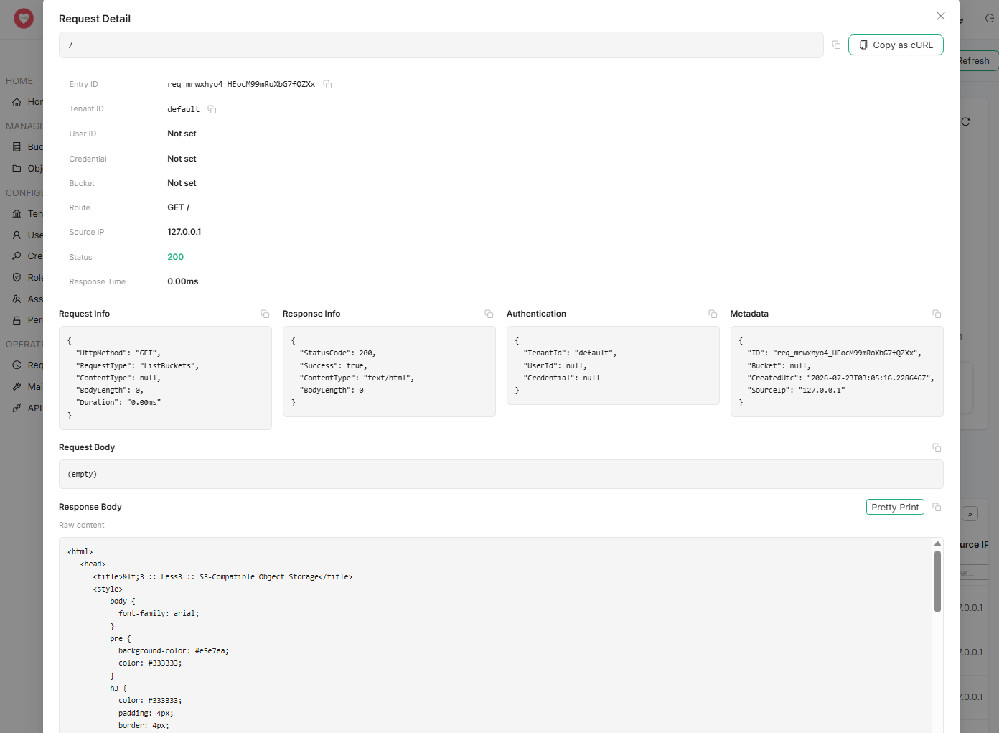
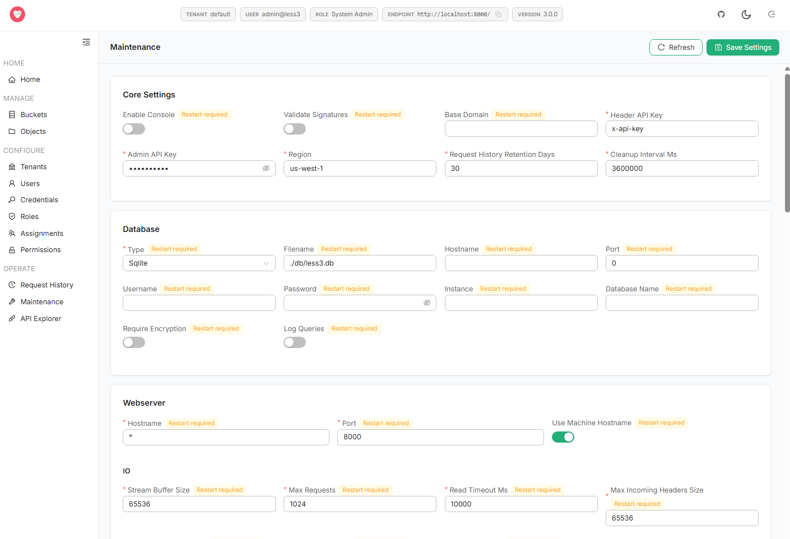
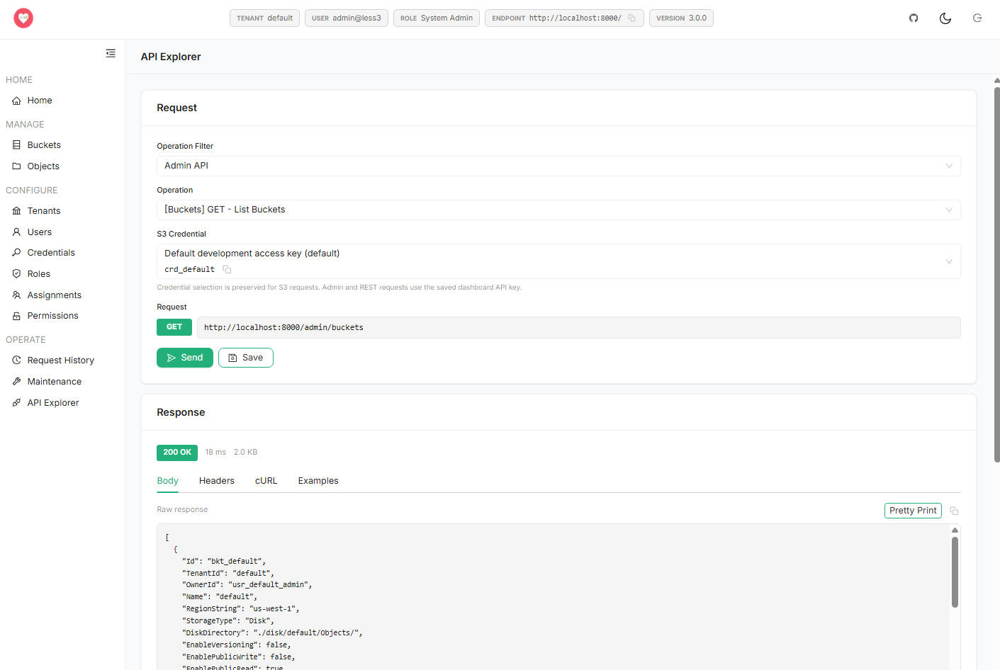

# Less3 :: S3-Compatible Object Storage

Less3 is an S3-compatible object storage platform that you can run anywhere. As of v4.0.0 the same binary runs two ways: as a standalone single node, or as a multi-node scale-out cluster.


## Two Ways to Run

**Standalone single-node** is the default when you run the binary natively. It uses a SQLite control plane, stores objects on local disk, and handles locking in process. Nothing external to install, nothing to provision — `dotnet run` and you have S3-compatible storage. For a laptop, a build agent, or a small private deployment, this is still the right answer, and the out-of-box experience is unchanged from earlier releases.

**Multi-node scale-out cluster** is the default in Docker. Several Less3 processes sit behind an nginx load balancer, all backed by one PostgreSQL control plane and one shared storage volume, coordinating every object mutation through a distributed lock (Clutch by default in Docker, or a native Postgres-backed lock). Reach for it when a single node is no longer enough — more request throughput than one process delivers, or surviving the loss of a node without losing the service.

The cluster keeps one authority for each kind of truth: PostgreSQL for metadata, lock state, and membership; shared storage for immutable blobs that are never overwritten in place. Every read-modify-write on an object — version increment, unversioned overwrite, delete, multipart complete or abort — runs under an exclusive distributed lock and a fencing token that is re-checked before the database commit. A lease that lapses mid-operation cannot corrupt data: the stale holder is fenced out at commit, its one request fails, and another node proceeds. Cluster mode refuses to start on SQLite, because a shared SQLite file cannot back multiple writers. The full operator walkthrough — provisioning Postgres, shared-storage mount rules, the settings blocks, health checks, observability, and the data-integrity model — lives in [`MULTINODE_SETUP.md`](MULTINODE_SETUP.md).

## Use Cases

Core use cases for Less3:

- Local object storage - S3-compatible storage on your laptop, virtual machine, container, or bare metal
- Private cloud object storage - use your existing private cloud hardware to create an S3-compatible storage pool
- Development and test - local devtest against S3-compatible storage
- Remote storage - deploy S3-compatible storage in environments where you must control data placement
- Scale-out storage - run several nodes behind a load balancer against a shared Postgres control plane and shared storage

## Current Version

v4.0.0

- Added the multi-node scale-out cluster: the same binary runs standalone (SQLite, local disk, in-process lock) or as a cluster (PostgreSQL control plane, shared storage, distributed lock, nginx load balancer)
- Added a pluggable distributed lock manager (`ILockManager`) with `Local`, `Postgres`, and optional `Clutch` (WebSocket) providers, using per-key fencing tokens re-checked at the database commit to keep a lapsed lease from corrupting data
- Added fair FIFO read/write/delete lock semantics: shared, uncapped concurrent reads; exclusive writes and deletes granted only after everything that arrived before them drains — reads can't starve a queued writer
- Moved blobs, object-write staging, and multipart parts onto shared storage so any node can complete or abort any upload
- Added cluster membership, the `/api/v1/cluster/*` and `/api/v1/locks` admin endpoints, and an unauthenticated `/healthz` probe for load balancers and orchestrators
- Made cleanup and schema migration leader-only, elected through lock leases and a Postgres advisory lock
- Metered every S3, REST, and admin API and added per-stage timestamps through every object operation (lock-acquire → metadata → storage → commit → blob-delete), surfaced in Grafana
- Added Radiant/Watson observability with per-node Prometheus metrics and a Docker stack shipping Prometheus, Grafana (five pre-provisioned dashboards), Loki, Tempo, an OpenTelemetry collector, and the Clutch lock server with its metrics scraped too
- Made PostgreSQL the default in Docker while native OOBE stays on SQLite; cluster mode refuses to start on SQLite
- See `CHANGELOG.md` for release details and `MULTINODE_SETUP.md` for the cluster operator guide

<details>
<summary><strong>Screenshots</strong></summary>

<details>
<summary>Dashboard home</summary>

The dashboard home summarizes tenant, bucket, object, storage, credential, request, failure-rate, and latency metrics, with quick actions and a request summary chart.

<a href="assets/ss1.png"></a>

</details>

<details>
<summary>Object details</summary>

The object browser exposes bucket contents and object metadata, including identifiers, size, storage class, delete marker state, and download URL.

<a href="assets/ss2.png"></a>

</details>

<details>
<summary>Object contents</summary>

The object contents view lets users inspect and edit text objects directly from the dashboard.

<a href="assets/ss3.png"></a>

</details>

<details>
<summary>Request history detail</summary>

Request history detail shows routing, tenant, status, timing, authentication, metadata, and request/response bodies, with cURL export support.

<a href="assets/ss4.png"></a>

</details>

<details>
<summary>Maintenance settings</summary>

Maintenance settings centralize core server, database, webserver, and IO configuration with restart-required indicators.

<a href="assets/ss5.png"></a>

</details>

<details>
<summary>API explorer</summary>

The API explorer builds authenticated admin and S3 requests, sends them from the dashboard, and displays body, headers, cURL, and example responses.

<a href="assets/ss6.png"></a>

</details>

</details>

## Help and Feedback

First things first - do you need help or have feedback?  Please file an issue here.

## Special Thanks

Thanks to @iain-cyborn for helping make the platform better!

## Initial Setup

### Prerequisites

- .NET 10.0 SDK or runtime
- Supported databases: SQLite (default for standalone), SQL Server, MySQL, or PostgreSQL (default and required for clusters)

### Quick Start (standalone single-node)

Clone, build, and run Less3 natively for a single-node SQLite deployment:

```bash
git clone https://github.com/jchristn/less3
cd less3
dotnet build src/Less3.sln
cd src/Less3
dotnet run
```

On first launch, Less3 will run a setup wizard that creates:
- `system.json` - Server configuration
- `less3.db` - SQLite database (default)
- A sample "default" bucket with test files

To re-run the setup wizard at any time:
```bash
dotnet run setup
```

### Quick Start (multi-node cluster)

The Docker default is a two-node PostgreSQL cluster behind nginx, with the full observability stack. From the `Docker` directory:

```bash
git clone https://github.com/jchristn/less3
cd less3
build-all.bat v4.0.0
cd Docker
docker compose up -d
```

`compose.yaml` uses the published, tagged images, so build and tag them first (`build-all.bat v4.0.0`), then bring the stack up. It starts PostgreSQL, two Less3 nodes sharing a storage volume, nginx on port `8000`, the dashboard on port `3000`, the Clutch lock server and dashboard, and Prometheus, Grafana, Loki, Tempo, and an OpenTelemetry collector. Point an S3 client at `http://localhost:8000` and requests round-robin across the nodes. See [`MULTINODE_SETUP.md`](MULTINODE_SETUP.md) for provisioning, shared-storage rules, the full HTTP port list, and running the same topology by hand. For one durable node on Postgres without the load balancer, use `docker compose -f compose.single.yaml up -d`.

### Starting the Dashboard

Less3 includes a web-based dashboard for managing buckets, objects, tenants, users, credentials, RBAC, request history, and maintenance. After starting the Less3 server, you can start the dashboard:

```bash
cd dashboard
npm install
npm run build
npm run start
```

The dashboard will be available at `http://localhost:3000`.

By default, the dashboard expects the Less3 server to be available at `http://localhost:8000` and validates that the configured endpoint exposes the Less3 admin API before saving it.

For development, you can use:
```bash
npm run dev
```

**Note**: The dashboard requires Node.js v18.20.4 or later.

### Publishing for Deployment

```bash
dotnet publish src/Less3/Less3.csproj -c Release -o ./publish
cd publish
dotnet Less3.dll
```

### Configuration Requirements

**Webserver.Hostname**: MUST be set to a DNS hostname. IP addresses are not supported (parsing will fail). Incoming HTTP requests must have a HOST header matching this value, or you will receive `400/Bad Request`.

**Wildcard Listeners**: Using `*`, `+`, or `0.0.0.0` for `Webserver.Hostname` requires administrative/root privileges (OS requirement).

### Key Configuration Settings (system.json)

```json
{
  "Webserver": {
    "Hostname": "localhost",
    "Port": 8000
  },
  "BaseDomain": null,
  "Storage": {
    "DiskDirectory": "./disk/",
    "TempDirectory": "./temp/"
  },
  "Database": {
    "Type": "Sqlite",
    "Filename": "./less3.db"
  },
  "AdminApiKey": "less3admin",
  "ValidateSignatures": true,
  "RequestHistoryRetentionDays": 30,
  "CleanupIntervalMs": 3600000,
  "UseTcpServer": false
}
```

## S3 Client Compatibility

Less3 was designed to be consumed using the AWS SDK, AWS CLI, MinIO Client (mc), or direct RESTful integration in accordance with Amazon's official S3 API documentation (https://docs.aws.amazon.com/AmazonS3/latest/API/Welcome.html).

### Tested and Compatible Clients

- **AWS SDK** (C#, Python, Java, etc.)
- **AWS CLI** - See `AWSCLI.md` for comprehensive testing commands
- **MinIO Client (mc)** - See `MINIO.md` for comprehensive testing commands
- **CloudBerry Explorer for S3** (https://www.cloudberrylab.com/explorer/windows/amazon-s3.aspx)
- **S3 Browser** (http://s3browser.com/)

Should you encounter a discrepancy between how Less3 operates and how AWS S3 operates, please file an issue with details and supporting AWS documentation.

## Supported S3 APIs

Less3 implements the following AWS S3 APIs. For a complete compatibility matrix, refer to the 'assets' directory.

### Service APIs
- **ListBuckets** - List all buckets

### Bucket APIs
- **CreateBucket** (Write) - Create a new bucket
- **DeleteBucket** (Delete) - Delete an empty bucket
- **HeadBucket** (Exists) - Check if bucket exists
- **ListObjectsV2** (Read) - List objects in a bucket
- **ListObjectVersions** (ReadVersions) - List object versions
- **GetBucketAcl** (ReadAcl) - Get bucket access control list
- **PutBucketAcl** (WriteAcl) - Set bucket access control list
- **GetBucketTagging** (ReadTagging) - Get bucket tags
- **PutBucketTagging** (WriteTagging) - Set bucket tags
- **DeleteBucketTagging** (DeleteTagging) - Delete bucket tags
- **GetBucketVersioning** (ReadVersioning) - Get bucket versioning configuration
- **PutBucketVersioning** (WriteVersioning) - Set bucket versioning (no MFA delete support)
- **GetBucketLocation** (ReadLocation) - Get bucket location/region
- **ListMultipartUploads** (ReadMultipartUploads) - List in-progress multipart uploads

### Object APIs
- **PutObject** (Write) - Upload an object
- **GetObject** (Read) - Download an object
- **HeadObject** (Exists) - Check if object exists
- **DeleteObject** (Delete) - Delete an object or version
- **DeleteObjects** (DeleteMultiple) - Delete multiple objects
- **GetObjectAcl** (ReadAcl) - Get object access control list
- **PutObjectAcl** (WriteAcl) - Set object access control list
- **GetObjectTagging** (ReadTagging) - Get object tags
- **PutObjectTagging** (WriteTagging) - Set object tags
- **DeleteObjectTagging** (DeleteTagging) - Delete object tags
- **GetObject with Range** (ReadRange) - Download partial object content

### Multipart Upload APIs
- **CreateMultipartUpload** (InitiateMultipartUpload) - Start a multipart upload
- **UploadPart** - Upload a part of a multipart upload
- **CompleteMultipartUpload** - Finalize a multipart upload
- **AbortMultipartUpload** - Cancel a multipart upload
- **ListParts** (ReadParts) - List parts of a multipart upload

## Implementation Notes

Less3 aims to faithfully implement S3 API behavior. However, there are a few minor differences that should be inconsequential for most use cases:

- **Version IDs**: Stored as integers internally rather than opaque strings (e.g., `1`, `2`, `3` instead of AWS-style strings)
- **Region**: Defaults to `us-west-1` (configurable via `RegionString` in system.json)
- **Signature Validation**: Can be enabled/disabled via `ValidateSignatures` setting (enabled by default)

If you encounter incompatibilities or unexpected behavior with supported APIs, please file an issue with:
- Description of the expected behavior
- Link to AWS S3 documentation
- Steps to reproduce the issue

## URL Styles: Path-Style vs Virtual Hosted

Less3 supports both S3 URL styles for accessing buckets and objects:

### Path-Style URLs (Default)
- **Format**: `http://hostname:port/bucket/key`
- **Configuration**: Do NOT set `BaseDomain` in system.json (leave it null)
- **Example**: `http://localhost:8000/mybucket/myfile.txt`
- **Use Case**: Simple setup, local development, no DNS configuration needed

### Virtual Hosted-Style URLs
- **Format**: `http://bucket.hostname:port/key`
- **Configuration Requirements**:
  1. Set `BaseDomain` to your base domain (e.g., `.localhost` - note the leading period)
  2. Set `Webserver.Hostname` to `*` (wildcard listener)
  3. Run Less3 with administrative/root privileges
  4. Ensure DNS resolves bucket subdomains to your Less3 server (e.g., `mybucket.localhost`)
- **Example**: `http://mybucket.localhost:8000/myfile.txt`
- **Use Case**: Production environments, AWS S3-like URL structure

**Configuration Example (system.json for virtual hosted-style)**:
```json
{
  "BaseDomain": ".localhost",
  "Webserver": {
    "Hostname": "*",
    "Port": 8000
  }
}
```

## Administrative APIs

Less3 provides REST APIs for administrative operations such as managing users, credentials, and buckets.

### Authentication
Admin APIs accept either the `x-api-key` header with a value matching `AdminApiKey` in system.json (default: `less3admin`) or an RBAC-authorized `x-less3-session-token` header.

### Endpoint Format
```
http://hostname:port/admin/{resource}/{operation}
```

### Available Resources
- **users** - Manage user accounts
- **credentials** - Manage access keys and secret keys
- **buckets** - Manage buckets and bucket configuration
- **stats** - Retrieve aggregate bucket, object, and storage metrics for dashboard and admin views
- **reports** - Retrieve request reporting summaries including request rate, failure rate, latency, and top usage fields
- **maintenance** - Inspect cleanup status, update runtime maintenance settings, purge request history, clean temp uploads, verify objects, and inspect migration status
- **effectivepermissions** - Inspect how RBAC would decide a principal/resource/operation request

### Example
```bash
curl -X GET http://localhost:8000/admin/users/list \
  -H "x-api-key: less3admin"
```

```bash
curl -X GET http://localhost:8000/admin/stats \
  -H "x-api-key: less3admin"
```

For detailed API documentation, refer to the project wiki.

## REST API

Alongside the S3 and admin surfaces, Less3 exposes a versioned REST API under `/api/v1/...` for tenant, credential, bucket, object, and cluster operations. In a cluster it also reports live topology and lock state:

- `GET /api/v1/cluster/nodes` - registered nodes and their heartbeat/health
- `GET /api/v1/cluster/health` - aggregate cluster health
- `GET /api/v1/cluster/leader` - the current cleanup/migration leader
- `GET /api/v1/locks` - all active locks across the cluster
- `GET /api/v1/locks/{key}` - the holders and waiters for one lock key
- `GET /healthz` - unauthenticated liveness/readiness probe returning `{status, nodeId, version}`, reflecting database and storage writability

The full REST surface is documented in [`REST_API.md`](REST_API.md); the S3 surface is documented in [`S3_API.md`](S3_API.md).

## Distributed Locking and Data Integrity

Data integrity is the design invariant for cluster mode. Every read-modify-write on object state — version increment, unversioned overwrite, delete, and multipart complete/abort, plus the blob delete that follows — runs under an exclusive distributed lock and is gated by a fencing token that is re-checked at the guarded database commit. If a lease lapses mid-operation, the stale holder is fenced out at commit: its one request fails and another node proceeds, so a slow or partitioned node can never corrupt data.

Locks are **fair FIFO** with read/write/delete modes:

- **Reads** take a shared lock and run concurrently with no cap. Object read paths hold the shared lock for the life of the streamed response.
- **Writes** are exclusive and are granted only after every request that arrived before them releases — a write lets pending reads flush first.
- **Deletes** are exclusive and drain everything ahead of them.

Ordering is strictly by arrival, so a steady stream of reads cannot starve a queued writer or deleter. The lock provider is pluggable via `Cluster.LockProvider`:

- **`Local`** - an in-process fair queue for single-node/SQLite deployments.
- **`Postgres`** (cluster default) - the database is the authority; each grant decision runs inside a PL/pgSQL function under a per-key advisory lock, so exactly one node decides at a time. Lease expiry uses the database clock, and each grant bumps a per-key monotonic fencing token.
- **`Clutch`** (alpha, opt-in) - connects to a Clutch server over its native WebSocket lock protocol with one persistent connection per node, so a node crash auto-releases every lock it held. Clutch performs the same fair drain server-side and shares the same Postgres via bring-your-own-database.

## Observability

Less3's library code is instrumented with base-class-library `Meter` and `ActivitySource` instruments under `Less3.*` names — no telemetry-SDK dependency in the instrumented code. Every S3, REST, and admin API operation is metered (request count and duration, labeled by surface and operation), and every object operation records per-stage timestamps throughout its execution (lock-acquire, metadata-read, storage read/write, database-commit, blob-delete).

Each node also exposes Watson's native Prometheus `/metrics` endpoint on its main port. In the Docker stack, Prometheus scrapes that endpoint directly for the Watson HTTP metrics, while the `Less3.*` domain metrics, traces, and logs are exported over OTLP to an OpenTelemetry collector and re-exported for Prometheus. Grafana ships with five pre-provisioned dashboards:

- **Less3 — Overview** - traffic, storage, and error-rate summary
- **Less3 — Locks & Data Integrity** - lock acquires/denials/waiters and the fencing-conflict counter, which should stay at zero
- **Less3 — Cluster** - node membership and health
- **Less3 — API Operations** - per-operation request rate, error rate, p95 latency, and object-operation stage timings
- **Less3 — Clutch Lock Server** - Clutch lock activity, WebSocket connections, and HTTP throughput (Clutch's own metrics are scraped into the same Prometheus)

## Open Source Packages 

Less3 is built using a series of open-source packages, including:

- AWS SDK - https://github.com/aws/aws-sdk-net
- S3 Server - https://github.com/jchristn/s3server
- Watson Webserver - https://github.com/jchristn/WatsonWebserver

## Docker Deployment

Less3 is available on [DockerHub](https://hub.docker.com/r/jchristn77/less3). The Docker default is a multi-node PostgreSQL cluster; a single-node-on-Postgres overlay is also provided.

### Multi-Node Cluster (default)

From the `Docker` directory:

```bash
build-all.bat v4.0.0
cd Docker
docker compose up -d
```

`compose.yaml` is the definitive multi-node deployment. It references the published, tagged images (`jchristn77/less3:v4.0.0`, `jchristn77/less3-ui:v4.0.0`), so build and tag them first with `build-all.bat v4.0.0`, then bring the stack up. It starts PostgreSQL 17, two Less3 nodes (`less3-node1` and `less3-node2`) sharing the `less3-data` volume mounted at `/less3`, nginx, the Less3 dashboard, the Clutch lock server and its dashboard, and the observability stack (an OpenTelemetry collector, Prometheus, Grafana, Loki, Tempo). The nodes read `system.node.json`, which sets `Cluster.Enabled`, `LockProvider: Clutch`, and the shared storage paths. Each node serves its Watson HTTP metrics at `/metrics` on its main port and pushes its `Less3.*` domain metrics to the collector over OTLP; Prometheus scrapes both.

The Docker stack routes Less3's locking through the bundled Clutch lock server by default, so each node holds a persistent lock WebSocket to Clutch (visible as two connections on the "Less3 — Clutch Lock Server" Grafana board) and the dashboard's "Manage Locks" action opens a live Clutch UI. Clutch shares this same PostgreSQL via bring-your-own-database, so the database stays authoritative for fencing tokens. Clutch is alpha; to use the in-database provider instead — no extra service, and the more battle-tested path — set `Cluster.LockProvider` to `Postgres` in `system.node.json`.

#### HTTP ports

The default stack publishes these host ports (PostgreSQL and the individual node listeners stay internal to the Docker network):

| Host port | Service | Purpose |
|---|---|---|
| 8000 | nginx | Single entry point, load-balanced across the nodes: S3 API, REST API (`/api/v1/...`), admin API (`/admin/...`), `/healthz`, per-node `/metrics`. |
| 3000 | less3-ui | Less3 dashboard. |
| 3001 | grafana | Grafana (anonymous admin); five Less3 dashboards pre-provisioned (Overview, Locks & Data Integrity, Cluster, API Operations, Clutch). |
| 9090 | prometheus | Prometheus UI / query API. |
| 3100 | loki | Loki log API. |
| 3200 | tempo | Tempo trace API. |
| 4317 / 4318 | otel-collector | OTLP ingest (gRPC / HTTP) for node metrics, traces, and logs. |
| 8080 | clutch | Clutch REST + lock WebSocket API (`ws://localhost:8080/v1.0/lock/connect`). |
| 3002 | clutch-ui | Clutch operator dashboard. |

See [`MULTINODE_SETUP.md`](MULTINODE_SETUP.md) for the full walkthrough (including the internal ports and running the same topology without Docker).

### Single Node on Postgres

For one durable node on a Postgres control plane without the load balancer or scale-out:

```bash
docker compose -f compose.single.yaml up -d --build
```

### Default Configuration
- **Port**: 8000 (nginx, or the single node directly)
- **Access Key**: `default`
- **Secret Key**: `default`
- **Admin API Key**: `less3admin`
- **Protocol**: HTTP (no SSL)
- **URL Style**: Path-style (`http://localhost:8000/bucket/key`)
- **Hostname**: `*` (accepts all incoming requests)

On first startup, Less3 detects an empty database and seeds the default tenant, the `default` access key and secret key, and a `default` bucket automatically.

### Building Your Own Image
```bash
cd src
docker build -t less3:custom -f Less3/Dockerfile .
```

**Important**: For production deployments, always:
1. Change the default access key, secret key, and admin API key
2. Use persistent volumes for the database and the shared storage volume
3. Point cluster nodes at a real shared filesystem (NFS/SMB/cluster-FS) mounted at the same path on every host — the demo's single named volume works only on one host (see `MULTINODE_SETUP.md`)

## Version History

Refer to CHANGELOG.md for details.
