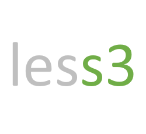

# Less3 UI

## Features

- Compact Less3 operator shell with grouped navigation
- Tenant, bucket, object, user, credential, role, role assignment, and permission management
- Credential create and rotate flows that show secrets once and hide them from metadata views
- Health, reporting KPI, request history, maintenance, and API Explorer views
- Multi-node cluster awareness: node health, leader election, and self-node indicators
- Distributed lock inspector with fencing tokens and lease-expiry hints (data-integrity guard)
- Observability hub linking the bundled Grafana and Prometheus dashboards (Overview; Locks & Data Integrity; Cluster)

## Environment Variables

- `NEXT_PUBLIC_LESS3_SERVER_URL` — Less3 server base URL (default `http://127.0.0.1:8000`)
- `NEXT_PUBLIC_LESS3_GRAFANA_URL` — Bundled Grafana URL (default `http://localhost:3001`)
- `NEXT_PUBLIC_LESS3_PROMETHEUS_URL` — Bundled Prometheus URL (default `http://localhost:9090`)

## Requirements

- Node.js v18.20.4
- npm

## Quick Start

### Development Setup

#### Install dependencies:

```bash
npm install
```

#### Start the production server (for using web ui locally):

```bash
npm run build
```

```bash
npm run start
```

OR

#### Start the development server (for development, can be used to test web ui locally as well):

```bash
npm run dev
```

The application will be available at `http://localhost:3000`.

### Testing

Run the test suite:

```bash
# Run all tests
npm test

# Run Playwright smoke tests
npm run test:e2e

# Run tests with coverage
npm run test:coverage

# Watch mode for development
npm run test:watch
```

## Deployment Process

#### Build the Application

Prepare the app for production:

```bash
npm run build
```

#### Start the Production Server

Start the built application:

```bash
npm run start
```

The app will be available at http://localhost:3000.

### Code Quality

The project uses several tools to maintain code quality:

- ESLint for code linting
- Prettier for code formatting
- Jest for testing
- Husky for pre-commit hooks

## Development Guidelines

1. **Code Style**

   - Follow the Prettier configuration
   - Use TypeScript for type safety
   - Follow component-based architecture

2. **Testing**
   - Write unit tests for components
